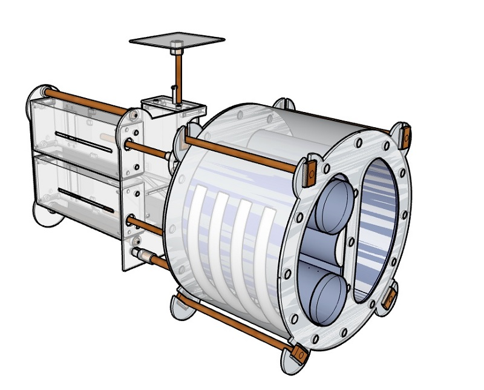
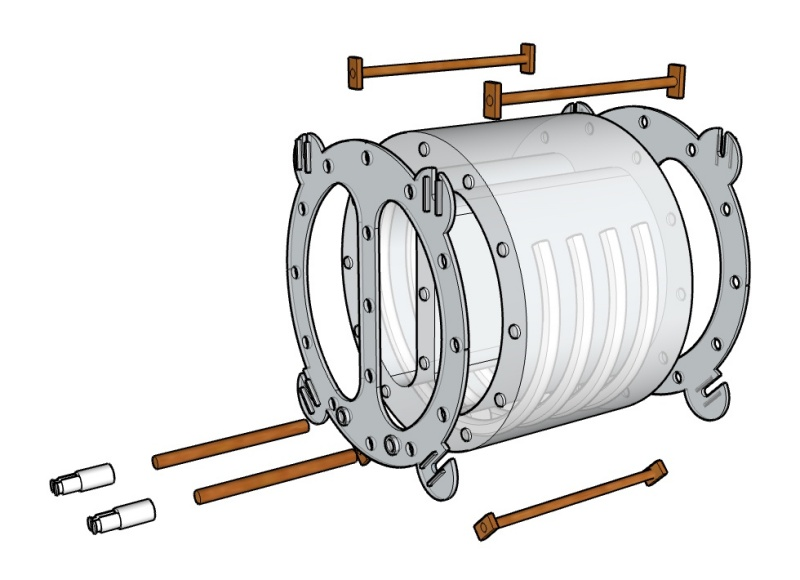
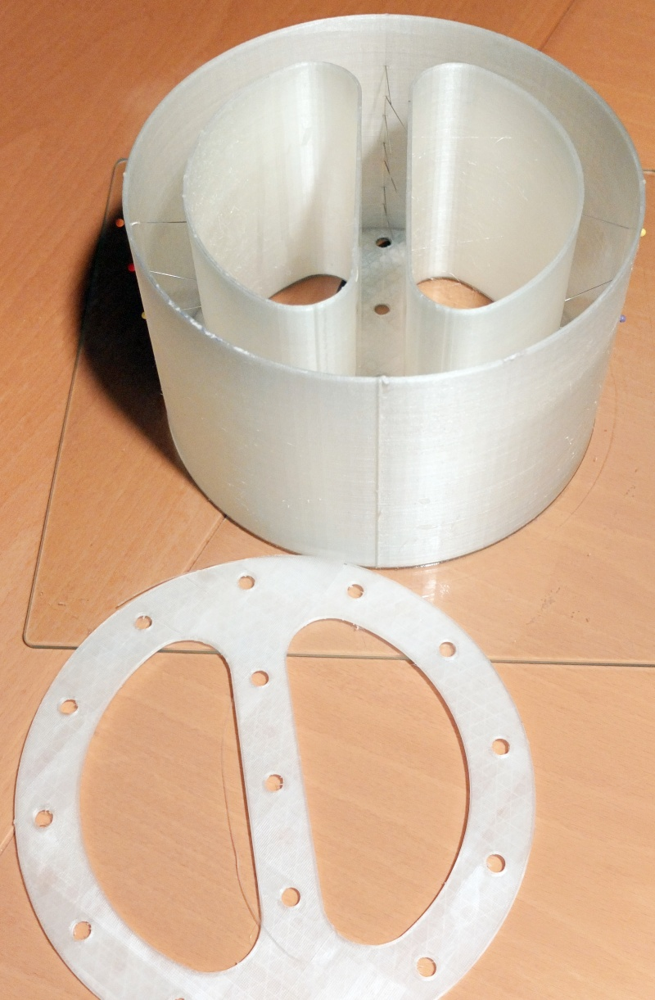
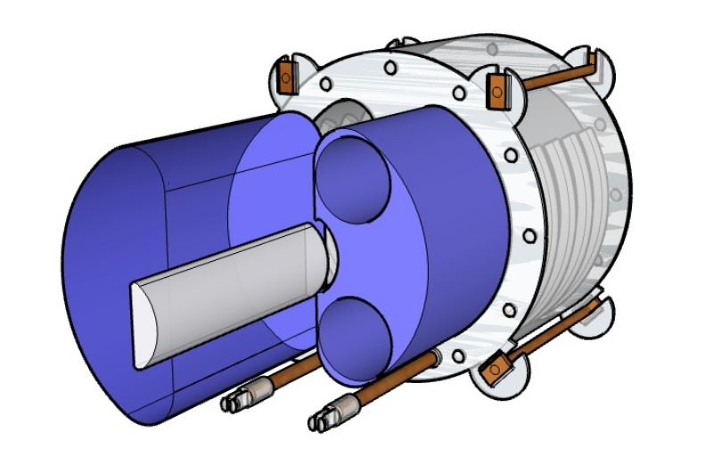
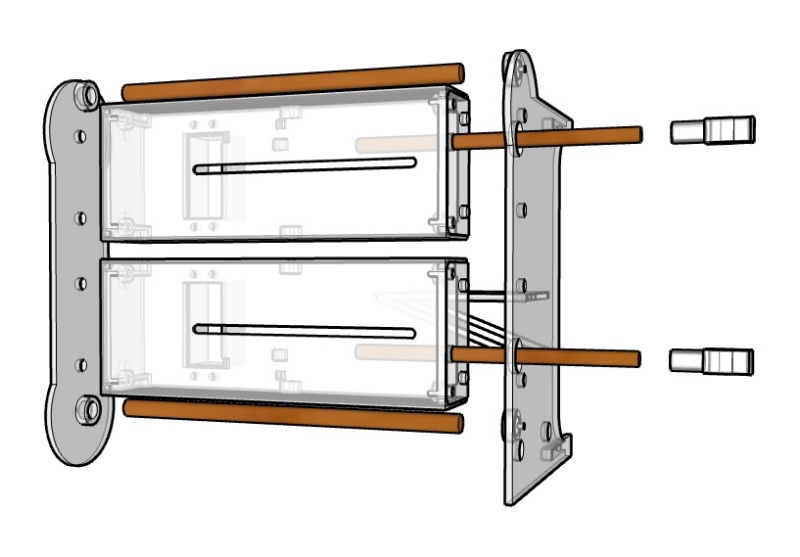
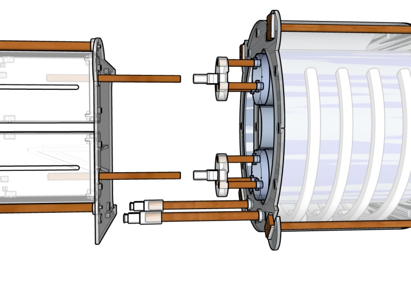
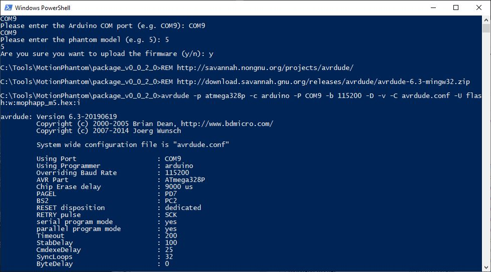

# Lung Motion X-Ray Imaging Phantom

In the field of medical imaging, so called imaging phantoms are used  to evaluate, analyze, and tune the performance of various imaging  devices (Source: Wikipedia). This specially developed imaging  phantom simulates motion and deformation of a lung based on respiratory motion.

The idea for this phantom came when I studied breathing motion in a lung. The motion in the lung is not uniform. The lower part of the lung moves more sideways whereas the upper part of the lung moves up and down. To simulate this, a phantom is required that does not only simulate motion but also simulates deformation. One examples that illustrates the motion in the lung: https://www.youtube.com/watch?v=kfcbAyLJHsI

On an X-Ray image, the material and the density define what is a  bone, a liver or a lung. Silicone for example is similar to human tissue whereas gypsum is similar to bone. The chest of this phantom is made of silicone, the cast-in rips made of gypsum and the lungs are made of 3D printed PLA.

In the left lung,  there are two freely movable cylinders to simulate motion and deformation in the lung. In each cylinder there is a pocket and an object with a higher density than the density of the lung.

This short animation gives you an idea how this phantom would look like on X-Ray images: https://youtu.be/TincNP1mlLw

To generate the motion, the phantom uses LnR-Actuators, an Arduino  micro controller and an Adafruit Servo Shield. The micro controller is  required because you cannot be in the room when you acquire X-Ray  images. The phantom can be either be remote controlled from a PC over an USB cable, or you can start one of the pre-programmed motion patterns and use the phantom stand-alone.

This phantom is suitable to evaluate and tune the performance of medical devices. A field of application could be the development of motion tracking and 4D reconstruction algorithms. With the choice of materials, imaging dosimetry should also be possible. 

The direct material costs are approximately USD 200.

### Supplies:

1 Arduino Uno

1 Adafruit 16-Channel Servo Shield

3 [LnR-Actuator](https://www.instructables.com/id/Linear-and-Rotation-Actuator/)

9 Screw M2 x l10

4 Screw M2 x l20

6 Wooden dowel d6 x l40 mm

4 Wooden dowel d6 x l150 mm

2 Wooden dowel d8 x l166 mm

2 Wooden dowel d8 x l120 mm

8 Wooden rectangular profile w10 x l20 x h4 mm with a hole d6 mm

1 Windows PC with Java 8 runtime and .NET Framework 4.6.2

1 3D Printer

1 Standing drill is of avail

750g PLA filament

750g PVA filament

3 kg of casting silicone

500g of modelling plaster

Legend: l:length, d:diameter, w: width, h:heigth

## Step 1: 3D Printed Parts

- PLA default, 20% infill: LMXIP-Back.stl, LMXIP-ChestBackPlate.stl, LMXIP-ChestFrontPlate.stl, LMXIP-CPUDistanceRing.stl, LMXIP-Front.stl, LMXIP-GatingBottom.stl, LMXIP-GatingTop.stl, Cmn-FrontClip.stl, Cmn-Flange.stl, Cmn-FlangeClip.stl, Cmn-GatingPlatform.stl

- PLA target, 90% infill: LMXIP-LungLeftInsert.stl, LungLeftLowerCylinderInsert.stl, LMXIP-LungLeftUpperCylinderInsert.stl

- PLA lung, 10% infill: LMXIP-LungLeft.stl, LMXIP-LungLeftLowerCylinder.stl, LMXIP-, LMXIP-LungLeftUpperCylinder.stl, LMXIP-LungRight.stl

- PVA form, 20% infill: LMXIP-ChestFormCover.stl, LMXIP-RipsForm.stl, LMXIP-SpineElementForm.stl, LMXIP-ChestForm.stl

## Step 2: Build the Skeleton

Mix some modeling plaster and fill the printed forms *LMXIP-RipsForm* and *LMXIP-SpineElementForm*. Wait until the plaster has dried; one day at least. Then wash off the PVA form. The plaster will not dissolve.

Use three small paper strips and glue the elements together. This is needed to insert the skeleton into the chest form.

## Step 3: Build the Phantom Body

Insert the skeleton into the *LMXIP-ChestForm*. Use some pins as shown on the picture to hold the skeleton in place.

Mix the casting silicone and gentle cast it into the *LMXIP-ChestForm*. Add the *LMXIP-ChestFormCover* and wait until the silicone has hardened (read the data sheet from the manufacturer). Then wash off the PVA form.

Glue the handles (rectangular profile w10 x l20 x h4 mm) to the wooden dowels d6 x l150 mm.

Fixate the *LMXIP-ChestFrontPlate* and the *LMXIP-ChestBackPlate* with the created handles.

Insert two wooden dowels d8 x l110 mm into the holes in the front plane of the body and attach a *Cmn-FrontClip.*

## Step 4: Add the Lungs

Glue the *LMXIP-LungLeftInsert* to the *LMXIP-LungLeft*. Gently push the *LMXIP-LungLeft* and the *LMXIP-LungRight* into the phantom.

## Step 5: Assemble the two Cylinders

Insert the *LMXIP-LungLeftUpperCylinderInsert* into the *LMXIP-LungLeftUpperCylinder* and fixate it with a drop of glue. Insert three wooden  dowels d6 x l40 mm into the holes in the front plane of the cylinder and attach a *Cmn-Flange*.

Insert the *LungLeftLowerCylinderInsert* into the *LMXIP-LungLeftLowerCylinder* and fixate it with a drop of glue. Insert three wooden  dowels d6 x l40 mm into the holes in the front plane of the cylinder and attach a *Cmn-Flange*.

## Step 6: Assemble the Actuators

To build the actuator assembly, fixate two wooden dowels d8 x l166 mm to the *LMXIP-Back* with two screws M2 x l20 mm. Plug-in the two *LnR-Actuators* and add the *LMXIP-Front*. Add a *Cmn-FlangeClip* to each of the *LnR-Actuators* but do not fixate it yet.

Plug-in the assembled phantom body into the actuator assembly. Connect the  flange with the flange clip. Align the cylinders and then fixate the  flange clips with some glue.

## Step 7: Add the Gating Platform

To build the Gating assembly, attach the *LMXIP-GatingBottom* to the *LMXIP-Front* with two screws M2 x l10 mm. Plug-in a *LnR-Actuator* and add the *LMXIP-GatingTop*. Fixate it with two screws M2x l10. Add the *Cmn-GatingPlatform* and fixate it with a screw M2 x l10 mm.

## Step 8:  Add the Micro Controller

Use four *LMXIP-CPUDistanceRing* to mount the Arduino on the *LMXIP-Front* and fixate it with  four screws M2 x l10 mm. Attach the Adafruit Servo Shield.

Connect the servos to the servo  shield in this order: Rotary (short cable) Lower, Upper, Gating. Longitudinal (long cable) Lower, Upper, Gating.

## Step 9: Install the Firmware and Calibrate

Download the package.zip (e.g. package_v0.0.1.1.zip) of the latest release from: https://github.com/mrstefangrimm/Phaso/releases/. The download includes the required scripts and the software to control the phantom. Unzip the package into a local folder, e.g. C:\Tools\MotionPhantom. 

Connect the phantom to your PC before the next steps.

In the download is a PowerShell script that uploads the firmware and write the calibration data to the EEPROM. To execute the script, open a PowerShell and change the directory to the target folder. Then type in: .\setup.ps1 and hit Enter. 

- The script now lists one or more COM ports. Enter the phantom's port (e.g. COM9).

- For the model, enter: 5

- Confirm the firmware upload with: y

  The script uses avrdude to upload the firmware. After the upload, the firmware is active.

- Confirm the EEPROM update with: y

  The script writes the default calibration to the EEPROM.

- Confirm to run a test with: y

  The test ends with the output: Complete and resets the firmware.

The phantom is ready to use.

## Step 10: Remote Control It With the Virtual Phantom Application

https://youtu.be/cEjuUass-fE

The Virtual Phantom Application is a .NET based application and part of the downloaded package (\Virms.NET\ViphApp.exe). The application is simulates X-Ray imaging. And it is possible to connect and control a phantom with the application.

The application always starts with the simulation of the Marker Motion  Phantom. Change the phantom on the left fly-in to "Lung Phantom".

If the phantom is plugged-in, the port should be listed. Make sure the right phantom is selected before you press "Connect"

On the right fly-in it is possible to either control the motion axes individually or start a program.