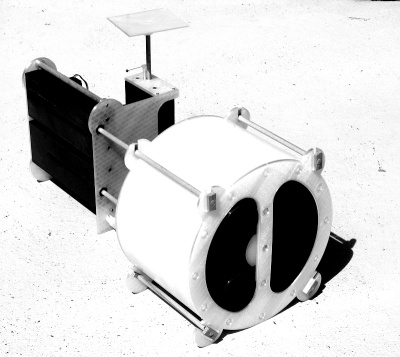

# Lung Motion X-Ray Imaging Phantom
No3 (working title) is a motion phantom with 3 motion axes which are controlled independently for both linear and rotary motion.

A [video on youtube](https://youtu.be/cEjuUass-fE) shows how the phantom works.

## Project History
The project was done in 2020.

## Construction

A detailed description how to build this phantom is published on *[Instructables.com](https://www.instructables.com/id/Lung-Motion-X-Ray-Imaging-Phantom/)*.

## Manufacturing Tool Chain

Software | License 
---- | -------
SketchUp | SketchUp Shop 
Ultimaker Cura | GPL

## License

This work is licensed under the Creative Commons Attribution-ShareAlike 4.0 International License. To view a copy of this license, visit http://creativecommons.org/licenses/by-sa/4.0/ or send a letter to Creative Commons, PO Box 1866, Mountain View, CA 94042, USA.